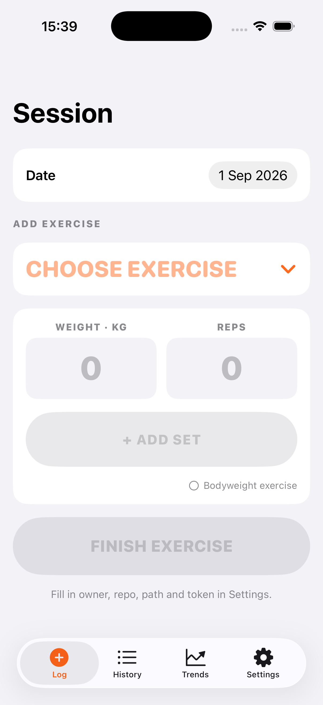
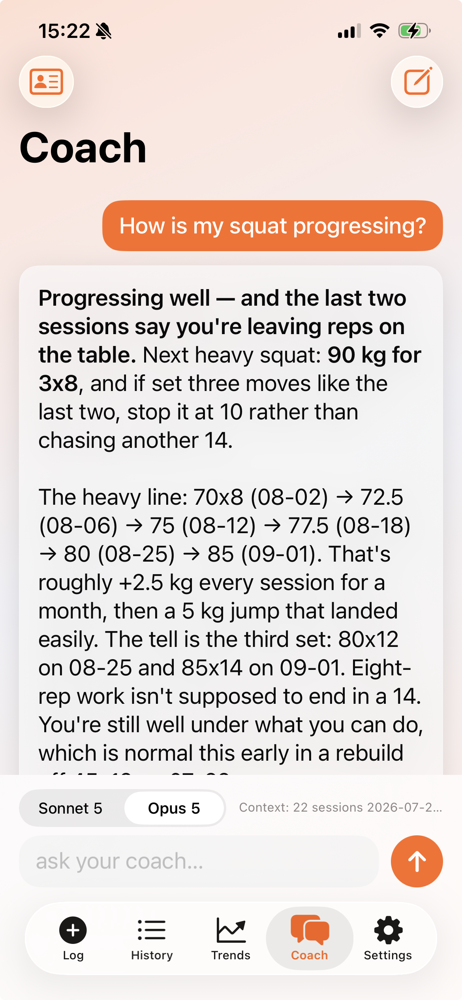

<p align="center">
  
</p>

# LiftLog

### An iOS workout log that lives in your own GitHub repo — with a Claude coach that reads it.

Log a session on the big number pads, and every set lands as a line of text in a
repo you control. No server, no database, no export — the file *is* the data,
which is exactly why an LLM can pick it up and coach from it with nothing in
between.

Ask **Coach** what to squat on Thursday and it answers from your own history:
real loads, real rep schemes, the dates it reasoned from. Tell it how you train
and what you're chasing in two more Markdown files beside the log, and it coaches
to your rules rather than a textbook's — changing its mind is a commit.

Point the app at any repo you control from the **Settings** tab (GitHub owner /
repo / path / branch + a fine-grained token). It reads and writes one file, so
your training history is portable, greppable, and outlives the app itself.

<p align="center">
  
  
</p>
<p align="center">
  <em><b>Session</b> — log it. &nbsp; <b>Coach</b> — ask about it.</em>
</p>

## Ask your log

Nothing to export, no schema to reverse-engineer: the whole file goes to the
model as it is. So these are questions you type into the app, not things you'd
have to build something to answer:

> _"Am I progressing on squat over the last two months, or just adding volume?"_
> _"Plan next week's lower body from my recent top sets."_
> _"Which lifts have stalled the longest, and what do I do about it?"_

You get numbers back. An actual answer, from the screenshot above:

> **Progressing well — and the last two sessions say you're leaving reps on the
> table.** Next heavy squat: **90 kg for 3x8**, and if set three moves like the
> last two, stop it at 10 rather than chasing another 14.
>
> The heavy line: 70x8 (08-02) → 72.5 (08-06) → 75 (08-12) → 77.5 (08-18) → 80
> (08-25) → 85 (09-01). […] The tell is the third set: 80x12 on 08-25 and 85x14
> on 09-01. Eight-rep work isn't supposed to end in a 14.

The prescription first, then the numbers it rests on — and a straight "the log
doesn't show that" when it can't support one. When it prescribes your next
session, each exercise comes as a card with a **Log** button — or one **Log the
session** button for all of them. Either way you land on the Session tab with
the lift and the first set filled in, the plan shown as a target, each set you
land prefilling the next, and the next exercise loading as you finish the last.
Every exercise still pushes on its own the moment it's done. Under each answer a
quiet line gives the API's own token counts and what they cost — switch it off
in *Settings ▸ Coach* if you'd rather not know.

The format **is** the data: greppable, diffable, readable by any model. Your
history stays portable and outlives the app — usable by tools that don't exist
yet, no migration required.

## `training.md` format

One line per exercise per day; a blank line separates dates:

```
2026-08-30 deadlift 82.5x8 82.5x8 82.5x8
2026-08-30 chin-ups bwx6 bwx6 bw+5x6
```

- **Date** — ISO `YYYY-MM-DD`. Exercises sharing a date form one session.
- **Exercise** — lowercase `kebab-case` (consistent spelling groups sessions for trends).
- **Sets** — space-separated `weightxreps` tokens: `82.5x8` (kg × reps),
  `bwx6` (bodyweight × reps), `bw+5x8` (bodyweight **+ 5 kg** × reps).

## Coach

Setting it up, and the details. Answers stream in, and a **Sonnet 5 / Opus 5**
picker sits above the input — Sonnet by default, Opus when you want it to chew
on a few years of history. It calls the
[Messages API](https://platform.claude.com/docs/en/api/messages/create) directly
over HTTPS, so there's no SDK or extra package to install.

### Teach it who you are

Two optional files beside your log, both plain Markdown with no schema:
**`coaching.md`** for how you like to train, **`goals.md`** for what you're
working toward.

```markdown
- Four days a week, upper/lower. Squat and deadlift once each.
- I add 2.5 kg upper / 5 kg lower when the top set moves cleanly.
- Left shoulder doesn't like flat barbell benching at volume.
- 140 kg squat by June. Currently 120. First meet in the autumn.
```

**Changing how you're coached is a commit** — edit, push, and the next answer
reflects it. Versioned and revertable like the log, with no model to fine-tune.

Edit both in the app from **Your brief** (the person icon in the Coach toolbar),
or let it interview you: *Set up your goals* asks a few questions — specific
ones, since it can already see your log — then writes `goals.md` and offers to
commit it. Once goals exist, the same button becomes *Update your goals* and
opens by asking what's changed. Both files are optional; rename or disable them
in *Settings ▸ Coach*.

### The API key

Create one in the [Claude Console](https://platform.claude.com/) and paste it
into *Settings ▸ Coach*, where it goes in the Keychain. **It is never in source
and never committed** — this repo is public. For Simulator work you can use an
`ANTHROPIC_API_KEY` scheme variable or an untracked `LiftLog/Secrets.plist`
instead; `.gitignore` covers both. Usage bills to your Anthropic account.

If your key isn't scoped to one workspace, the API also needs a workspace ID —
the `wrkspc_…` from [Settings ▸ Workspaces](https://platform.claude.com/settings/workspaces),
pasted into the same screen. A workspace-scoped key needs nothing extra.

Your question and log go straight to `api.anthropic.com` over TLS, and are never
logged or stored anywhere else.

> **Before giving this app to anyone else**: a key inside the binary can be
> extracted from it. Put a small backend in front that holds the key server-side
> and point `ClaudeService` at that instead.

## Open & run
- Open **`LiftLog.xcodeproj`** in Xcode.
- Source lives in `LiftLog/` (an Xcode 16 synchronized folder, so files in it
  are part of the target automatically — just add new files there).
- The whole palette is `Theme.accent`; the app icon is drawn from it by
  `Scripts/make-icon.py` (needs `pillow`), so a re-skin is one constant and one
  re-run rather than an edited PNG.
- Select your iPhone as the run destination and press ▶. Free provisioning runs
  it for 7 days per rebuild; a paid Apple Developer account keeps it installed.
- First run: enable **Developer Mode** on the phone (Settings ▸ Privacy & Security)
  and **Trust** the developer (Settings ▸ General ▸ VPN & Device Management).

## Features

**Session** — logging, built for a gym floor.
- A searchable exercise picker: your own history first, then a built-in
  library, or just type a new name.
- Big number pads. Under the weight field, what to load per side — worked out
  from the plates you actually own, so it never suggests one you don't have.
- Land a set and it's felt. A set that beats your all-time best for the lift
  gets a **PR** badge and a heavier buzz.
- A rest timer that starts on every set, fills toward a target you pick
  (1:00 / 1:30 / 2:00 / 3:00), and buzzes once when you're due. The digits roll
  like a stopwatch.
- "Today's Session" builds up live. Each finished exercise pushes to GitHub on
  its own — nothing waits on an "end session" tap that a dead phone could swallow.
- When Coach hands over a session: the plan shows as a target, each set
  prefills the next, and the next lift loads as you finish the last.

**History** — every session, newest first. Pull to refresh. Tap an exercise to
edit it, swipe to delete; both push like any other change.

**Trends** — a progression chart per lift: top-set weight, Est. 1RM, or added
load / max reps for bodyweight lifts, with short-term (3-week) and all-time
change tiles. Drag along the line to read a session off it. Drawn so it can
never show a peak you didn't lift.

**Coach** — a chat with Claude that has your `training.md` in front of it. Ask
"what session should I do today" and get loads and rep schemes cited from your
own numbers, with a **Log the session** button. Teach it who you are with
`coaching.md` and `goals.md`, or let it interview you. See [Coach](#coach).

**Settings** — the GitHub repo and token, the Claude key, your bar and plates,
and the offline sync queue.

## Tests
The pure-logic layer (parsing, serialization, analytics) lives in `LiftLog/Core`
and is Foundation-only, so it builds and runs as a Swift package with no
simulator:

```
swift test
```

The same files compile into the iOS target via Xcode's synchronized folder, so
`swift test` exercises the exact production code. Coverage: `training.md`
parse/serialize round-trips, the `bw` / `bw+5` bodyweight tokens, malformed-line
handling, the Trends analytics (top-set, Est. 1RM, added-load series, change
tiles), and the Coach context builder — how much log gets sent, how the brief is
assembled, and that what reaches the model still round-trips through the parser.

## GitHub token
Create a **fine-grained personal access token** scoped to only this repo with
**Contents: Read and write**, and paste it into the Settings tab. It's stored in
the iOS Keychain, never in source or UserDefaults.

## How saves stay safe
Each save **fetches the current `training.md`, merges the one edited exercise into
it, then writes** — it never serializes stale in-memory state, so a save can't drop
history that exists on GitHub. The fetch bypasses the URL cache and retries on
GitHub 409 conflicts to avoid stale-SHA errors.

## Offline
Gyms eat signal, so writes are offline-first. If a save (or delete) can't reach
GitHub, it's **queued locally and applied optimistically** — the entry shows up in
the app immediately — and the file's last-known content is cached so History and
Trends still work with no connection. The queue **flushes automatically on the next
successful load or save**, replaying each change through the same safe
merge-on-remote path; you can also see and retry it from **Settings ▸ Waiting to
sync**. The queue survives an app kill (persisted in `UserDefaults`; the token stays
in the Keychain).

The exercise you're mid-way through — sets landed, the plan, the rest clock —
and the Coach conversation both survive the app being killed in the background,
and come back on the next launch. Gyms also eat battery, and iOS quietly kills
whatever's behind the music app.

---

<p align="center">
  <a href="https://claude.com/claude-code"></a>
</p>

<p align="center">
  <sub>Built in <a href="https://claude.com/claude-code">Claude Code</a>. The Coach tab, the brief and the interview
  were laid down with Claude Opus 5; the steel, the motion and the prescriptions with
  <b>Claude Fable 5.1</b>. The commits say which.</sub>
</p>
